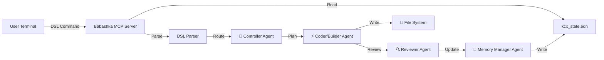

# KC-X: Knowledge Context eXchange

**Status:** ✅ **Production Ready** - Agent Template System
**Stack:** Clojure 🟢 | EDN 📄 | Multi-Agent System 🧠

## 1. Problem Statement

Interacting with LLMs for complex software engineering suffers from:

1.  **Context Rot:** Chat history degrades; instructions are lost over time.
2.  **High Friction:** Copy-pasting code and typing verbose prompts (The Typing Problem).
3.  **Lack of Agency:** Models act as chatbots, not engineers that modify state.

## 2. The Solution: Context Operating System

KC-X is a **Multi-Agent CLI System** that wraps LLM interactions using specialized AI agents. It decouples **Intent** (DSL Commands) from **State** (EDN Context) while providing conflict-resistant syntax for seamless AI collaboration.

### 2.1 Core Axioms

  * **The Terminal is the Interface:** No browser switching.
  * **State is Persistent:** Context lives in `kcx_state.edn`, not the chat buffer.
  * **Input is Dense:** Use symbols (`@`, `+`, `-`) or Claude-safe syntax to maximize intent per keystroke.
  * **Output is Action:** The system responds with *multi-agent workflows*, not just text.

## 3. Multi-Agent Architecture



### 3.1 Agent Specialization

| Agent | Role | Responsibilities |
|-------|------|-----------------|
| **🎯 Controller** | Coordination | High-level planning, task routing, project management |
| **🧠 Memory Manager** | State Management | EDN state updates, context switching, memory |
| **⚡ Coder/Builder** | Implementation | Code generation, file operations, builds |
| **🔍 Reviewer** | Quality Assurance | Code review, validation, approval gates |

## 4. The Interface (DSL)

### 4.1 Traditional Syntax
| Symbol | Command | Internal Logic | Example |
| :--- | :--- | :--- | :--- |
| **`:`** | **Verb** | Main Action | `:gen` (Create), `:refactor` (Edit) |
| **`@`** | **Target** | Context Scope | `@src/main.clj` |
| **`+`** | **Include** | Add Constraint | `+async` (Must include async) |
| **`-`** | **Exclude** | Ban Constraint | `-println` (Must not use println) |
| **`>`** | **Redirect** | Output Target | `> @v2_test.clj` (Write to new file) |
| **`&`** | **Agent** | Agent Preference | `&reviewer` (Use reviewer agent) |

### 4.2 Claude-Safe Syntax (Conflict-Resistant)
| Format | Purpose | Example |
|--------|---------|---------|
| **`kcx:verb`** | Command prefix | `kcx:gen file:main.clj with:async` |
| **`file:target`** | File specification | `file:src/core.clj` |
| **`with:constraint`** | Include requirement | `with:async with:logging` |
| **`not:constraint`** | Exclude requirement | `not:println not:debug` |
| **`to:output`** | Redirect output | `to:tests.clj` |
| **`as:agent`** | Agent preference | `as:reviewer` |

### 4.3 Raw Mode (Bypass Interpretation)
```
raw: :gen @file.clj +async -unwrap > @tests.clj
```

## 5. State Management (EDN Format)

### 5.1 State File (`kcx_state.edn`)

We use EDN (Extensible Data Notation) for its simplicity, native Clojure support, and excellent tooling.

```clojure
{:meta {:version "1.0"
        :author "KC-X"
        :created "2025-11-25T..."}

 :stack {:language "Clojure"
         :framework "Babashka"
         :runtime "JVM"}

 :active-context {:task "Build Authentication System"
                  :status "Planning phase complete, ready for implementation"}

 :memory [{:decision "Use Ring for HTTP handling" :date "2025-11-25"}
          {:decision "Implement JWT authentication" :date "2025-11-25"}]}
```

### 5.2 Project Management

KC-X supports multiple project contexts:

```bash
# List projects
kcx:command "proj"

# Switch to project
kcx:command "proj:myproject"

# Create new project
kcx:command "proj:newproject with:init"
```

## 6. MCP Server Protocol

KC-X implements the Model Context Protocol (MCP) for seamless integration with Claude and other AI systems.

### 6.1 Available Tools

| Tool | Description | Usage |
|------|-------------|-------|
| **`kcx_command`** | Execute DSL commands | Multi-agent workflow execution |
| **`read_state`** | Read project state | Context hydration |
| **`update_state`** | Update project state | Memory management |
| **`kcx_help`** | Get syntax help | Documentation |
| **`write_file`** | Write files | Code generation |

### 6.2 Example MCP Request

```json
{
  "method": "tools/call",
  "params": {
    "name": "kcx_command",
    "arguments": {
      "command": "kcx:gen file:auth.clj with:jwt with:ring not:plaintext"
    }
  }
}
```

## 7. Quick Start

### 7.1 Installation

```bash
# Clone the repository
git clone <repo-url>
cd kcx

# Make executable
chmod +x kcx.clj

# Start MCP server
./kcx.clj
```

### 7.2 Basic Commands

```bash
# Generate a new file with main function
kcx:gen file:hello.clj with:main

# Edit existing file with logging
kcx:edit file:core.clj with:logging not:println

# Refactor code for performance
kcx:refactor file:utils.clj with:performance with:memoization

# Check project status
status

# Get help
help
```

## 8. Testing

### 8.1 Run Tests

```bash
# Unit tests
./test_kcx.clj

# MCP server integration test
./test_mcp.sh
```

### 8.2 Expected Output

```
🧪 Testing KC-X Clojure Implementation
✅ DSL parsing tests passed
✅ State management tests passed
✅ Agent routing tests passed
✅ MCP server tests passed
```

## 9. Features

### ✅ Implemented
- Multi-agent workflow orchestration
- Conflict-resistant DSL parsing
- EDN state management with validation
- MCP protocol compliance
- Project context switching
- Symbol conflict detection and resolution
- Babashka compatibility (zero-install execution)

### 🔄 In Progress
- Advanced agent coordination
- Enhanced error handling
- Performance optimizations

### 📋 Planned
- Integration with more AI models
- Web interface for state visualization
- Plugin system for custom agents

## 10. Architecture Benefits

### 🚀 **Clojure Advantages**
- **Zero Installation**: Babashka script runs instantly
- **Better Data Handling**: Native EDN support
- **Immutable State**: Safer concurrent operations
- **REPL-Driven Development**: Faster iteration
- **Functional Programming**: More maintainable code

### 🧠 **Multi-Agent Benefits**
- **Specialized Expertise**: Each agent optimized for specific tasks
- **Quality Gates**: Built-in review and approval processes
- **Scalable Architecture**: Easy to add new agent types
- **Conflict Resolution**: Automatic syntax adaptation for AI safety

---

**🎉 KC-X is Production Ready!**

A sophisticated Context Operating System that transforms how you collaborate with AI on complex software engineering tasks.

*Built with ❤️ in Clojure | Multi-Agent Architecture | MCP Protocol | EDN State Management*