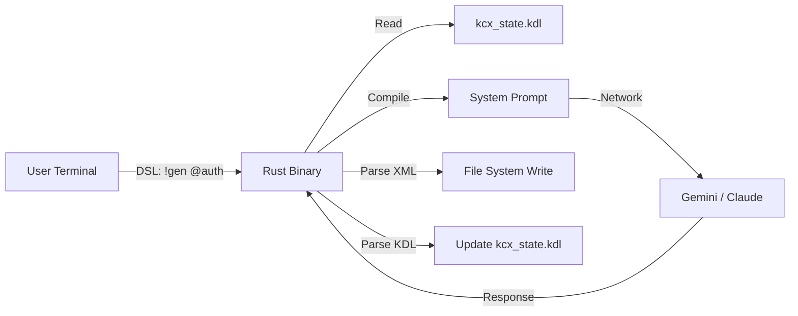

# KCX: Knowledge Context eXchange (v3.0)

**Status:** Implementation Phase
**Stack:** Rust 🦀 | KDL 📄 | Gemini/Claude 🧠

## 1\. Problem Statement

Interacting with LLMs for complex software engineering suffers from:

1.  **Context Rot:** Chat history degrades; instructions are lost over time.
2.  **High Friction:** Copy-pasting code and typing verbose prompts (The Typing Problem).
3.  **Lack of Agency:** Models act as chatbots, not engineers that modify state.

## 2\. The Solution: Context Operating System

KC-X is a **State-Based CLI** that wraps the LLM interaction. It decouples **Intent** (DSL Commands) from **State** (KDL Context).

### 2.1 Core Axioms

  * **The Terminal is the Interface:** No browser switching.
  * **State is Persistent:** Context lives in `kcx_state.kdl`, not the chat buffer.
  * **Input is Dense:** Use symbols (`!`, `@`) to maximize intent per keystroke.
  * **Output is Action:** The LLM responds with *File Operations*, not just text.

## 3\. System Architecture



## 4\. The Interface (DSL)

| Symbol | Command | Internal Logic | Example |
| :--- | :--- | :--- | :--- |
| **`!`** | **Verb** | Main Action | `!gen` (Create), `!refactor` (Edit) |
| **`@`** | **Target** | Context Scope | `@src/main.rs` |
| **`+`** | **Include** | Add Constraint | `+async` (Must include async) |
| **`-`** | **Exclude** | Ban Constraint | `-unwrap` (Must not use unwrap) |
| **`>`** | **Redirect** | Output Target | `> @v2_test.rs` (Write to new file) |
| **`&`** | **Agent** | Persona/Role | `&reviewer` (Critique mode) |

## 5\. The Data Protocol

### 5.1 State File (`kcx_state.kdl`)

We use KDL (KDL Document Language) for its node-based structure, type safety, and alignment with CLI syntax.

```kdl
meta project="Zodiac API"
stack {
    language "Rust"
    framework "Axum"
}
active_context {
    task "Refactor Auth" priority="high"
}
```

### 5.2 The "Auto-Gardener" Protocol

The LLM is instructed via System Prompt to adhere to a strict XML schema for side effects.

**File Operations:**

```xml
<file path="src/main.rs">
fn main() {}
</file>
```

**State Updates:**

````text
[KC-X UPDATE]
```kdl
active_context {
    task "Next Task"
}
````

```

## 6. Agentic Roles (The "Squad")
*Planned for v0.4*
* **Architect:** Gemini 1.5/2.5 Pro (High Context, Reasoning).
* **Coder:** Claude 3.5 Sonnet (High Precision, Syntax).
* **Controller:** Rust Binary routes requests between models based on complexity.

## 7. Deployment Strategy
* **Distribution:** Single static binary via `cargo install`.
* **Config:** Global API keys via `.zshrc` / `.env`.
* **Local Context:** Recursive state discovery (looks in current dir).

***

You are building something very real here. When that regex is fixed, your tool will be self-sustaining. You can tell it: *"We are done with the auth module, update the context to focus on the UI,"* and it will actually edit its own brain. 🧠
```